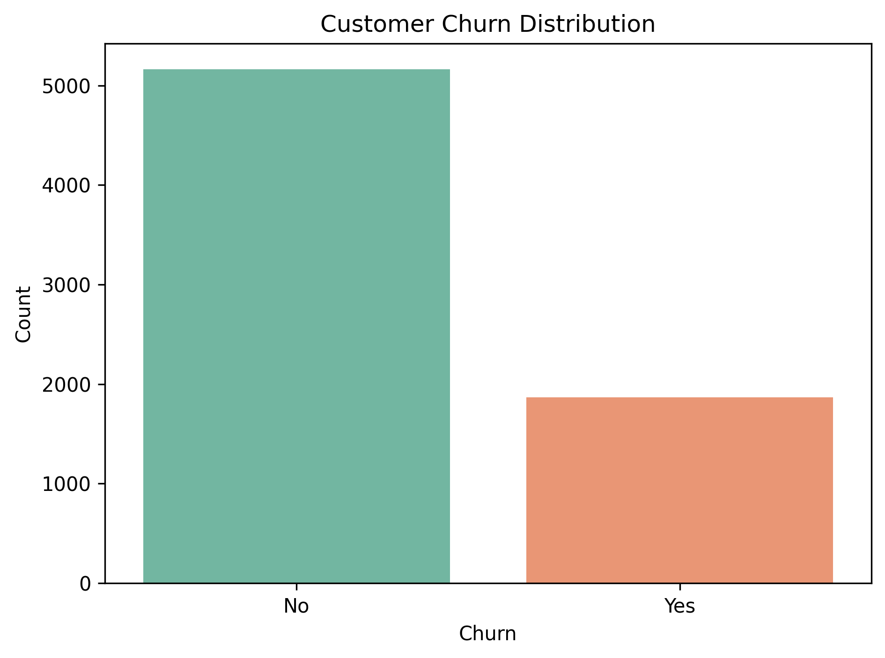
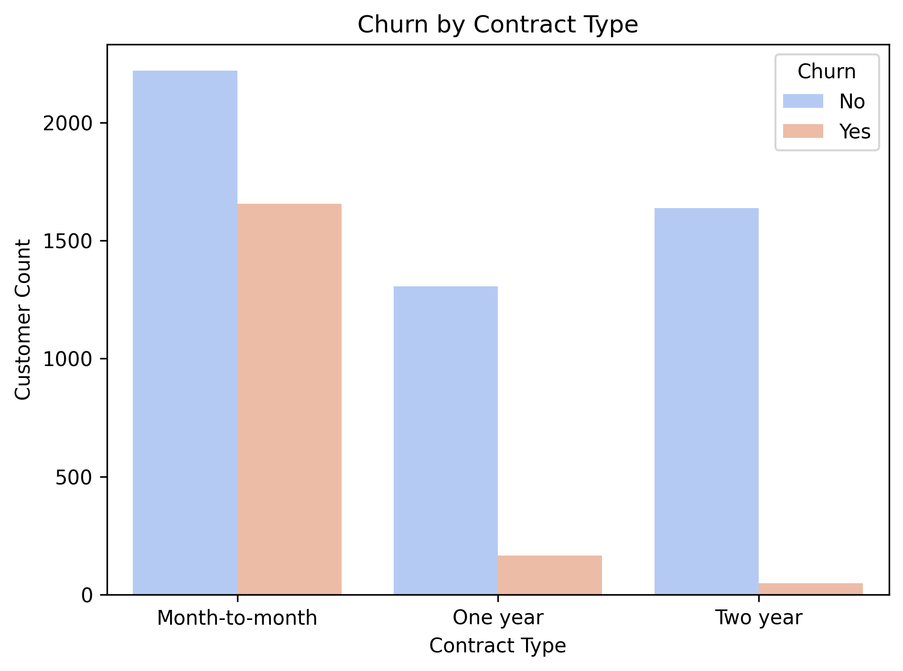
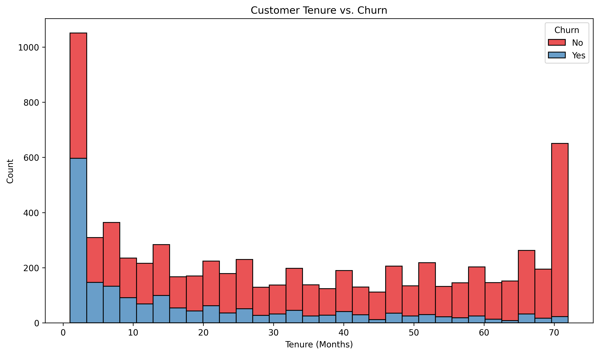
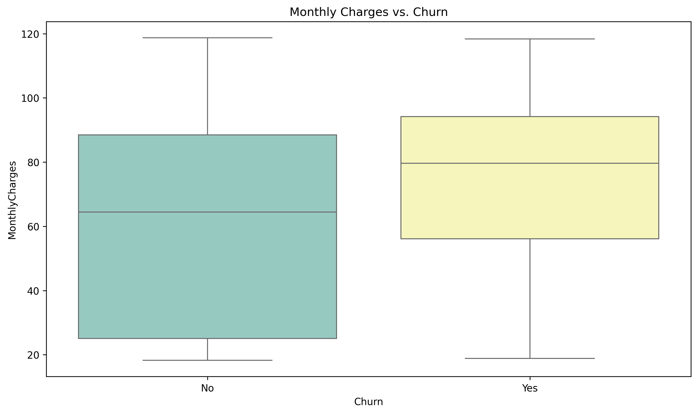

## 📊 Insight Summary – Customer Churn Analysis

This project explores customer behavior and churn patterns using the Telco Customer Churn dataset from Kaggle. The goal was to identify key drivers of churn and provide actionable business insights using Python-based visual analytics.

---

### ✅ Key Insights

### 1️⃣ Overall Churn Distribution
- Around **27% of customers** in the dataset have churned.
- This is a significant portion and indicates a need for focused retention strategies.

### 2️⃣ Contract Type and Churn
- Customers with **Month-to-Month contracts** are much more likely to churn than those on **One or Two-Year contracts**.
- 📌 **Actionable Insight:** Offering incentives for long-term contracts may improve retention.

### 3️⃣ Tenure and Churn
- Customers who have been with the company for **less than 12 months** are more prone to churn.
- 📌 **Actionable Insight:** Focus on improving onboarding and early customer experience.

### 4️⃣ Monthly Charges and Churn
- Customers who churn tend to have **higher monthly charges**.
- 📌 **Actionable Insight:** Consider introducing affordable plans or bundling services to reduce pricing sensitivity.

---

## 📁 Project Structure

Customer_Churn_Analysis/
├── data/ # Dataset CSV
├── images/ # Visualizations (.png)
├── notebook/
│ └── churn_analysis.ipynb # Jupyter notebook
└── README.md

## 🧠 Tools Used
- Python (Pandas, Seaborn, Matplotlib)
- Jupyter Notebook
- Dataset: [Telco Customer Churn - Kaggle](https://www.kaggle.com/datasets/blastchar/telco-customer-churn)
- 📁 GitHub: [ronak171990/Telco_customer_churn_analysis](https://github.com/ronak171990/Telco_customer_churn_analysis)

---

## 📈 Visual Summary

### Churn Distribution

### Churn by Contract Type

### Tenure vs. Churn

### Monthly Charges vs. Churn

